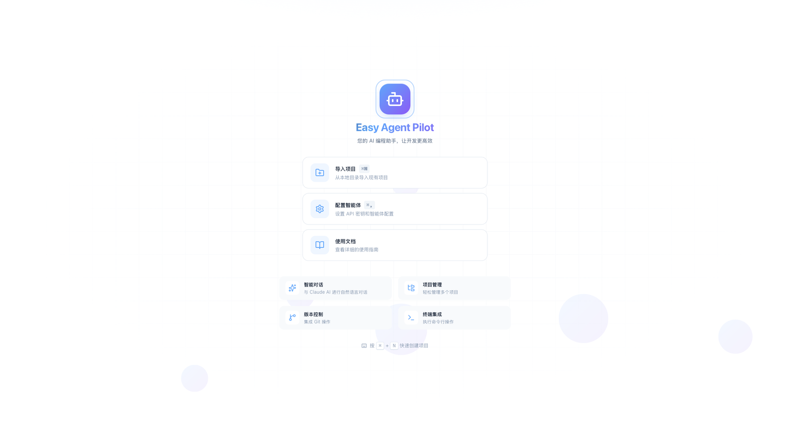
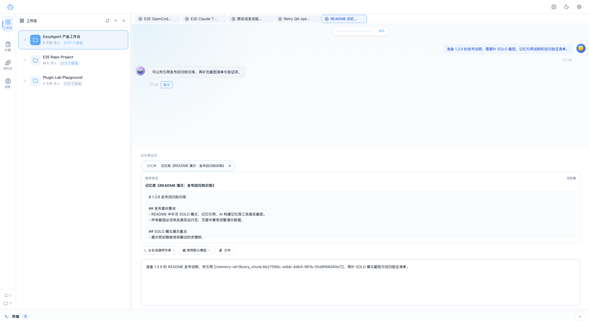
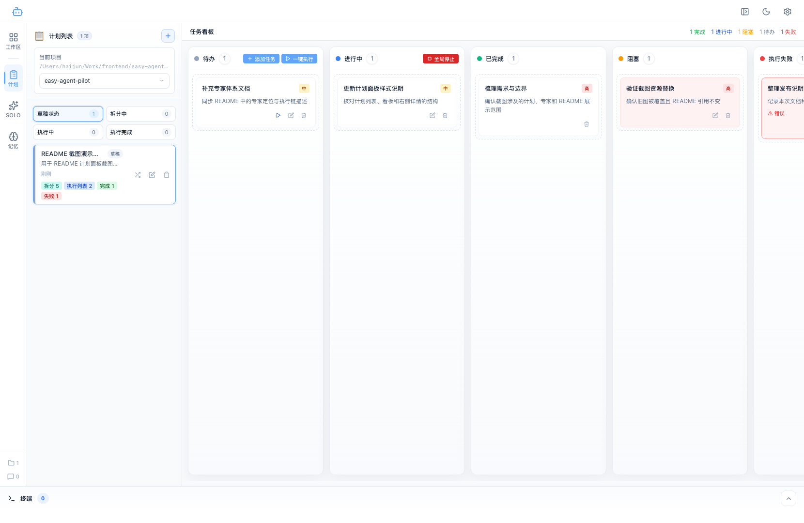
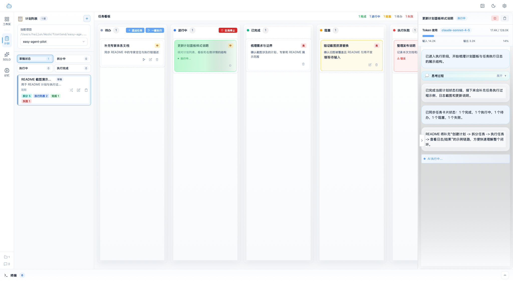
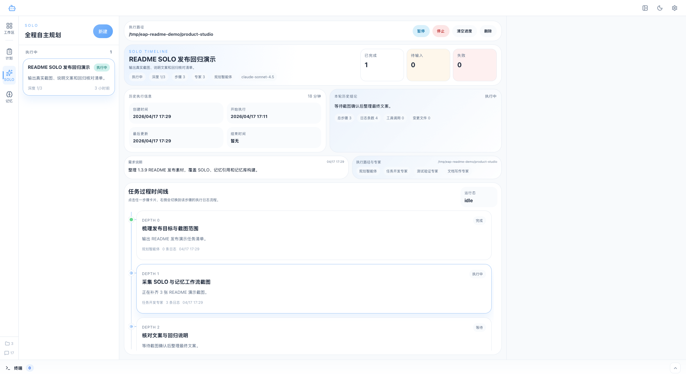
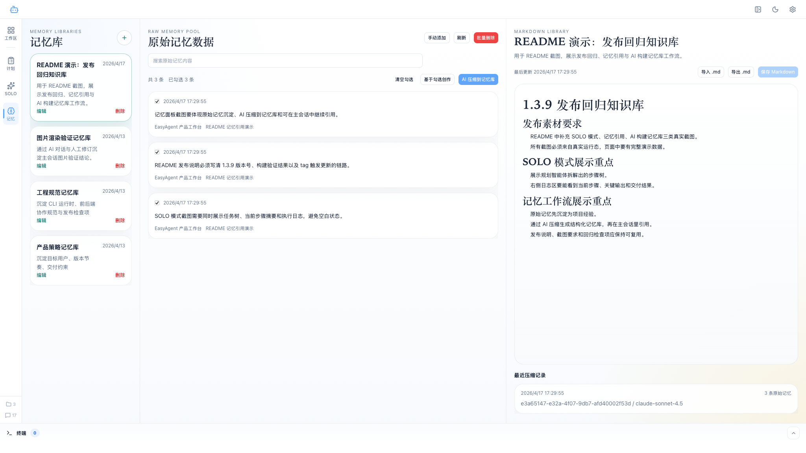
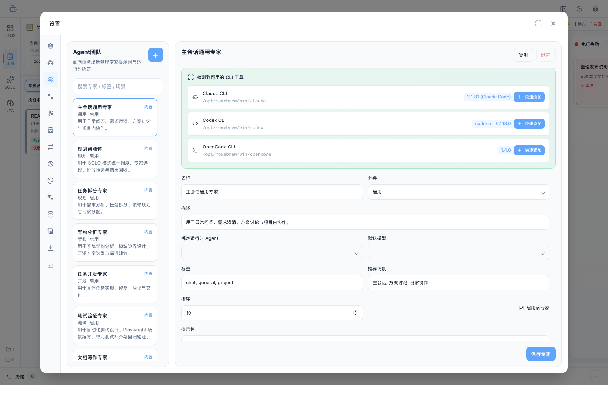
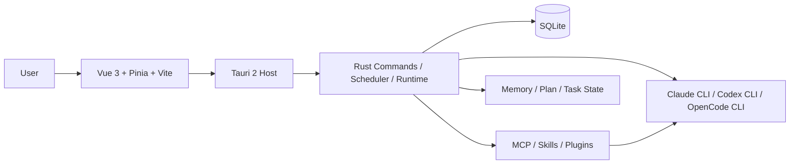

# Easy Agent Pilot

<p align="center">
  
</p>

<p align="center">
  <strong>一个面向本地开发环境的 AI Agent 桌面工作台。</strong><br />
  把项目上下文、主会话、计划拆分、任务执行、专家体系、记忆、扩展配置和无人值守整合到同一个 Tauri 桌面应用里。
</p>

<p align="center">
  
  
  
  
  
</p>

---

## 它是什么

Easy Agent Pilot 不是一个“把模型接进聊天框”的轻量客户端，而是一个围绕 **项目交付流程** 设计的本地 AI 工作台。

它解决的是下面这类问题：

- 一个项目里会同时存在需求澄清、实现、排障、重构、测试、发布准备等多条上下文，普通聊天窗口很快失控。
- 单个模型调用不稳定，角色、运行时、工具链和模型经常混用，导致结果不可复现。
- 复杂任务需要拆分、排队、执行、回看日志、沉淀知识，而不是停留在单轮问答。
- MCP / Skills / Plugins / Provider Profile / CLI 配置分散在不同位置维护，长期使用成本高。

Easy Agent Pilot 的核心思路是：

- 以 **项目** 为组织单元，而不是以聊天会话为中心。
- 以 **专家 + 运行时 + 模型** 作为稳定执行链，而不是直接裸调模型。
- 让 **主会话、计划拆分、任务执行、记忆、扩展配置** 形成一条完整闭环。
- 默认 **本地优先存储**，所有会话、计划、日志、记忆、配置都沉淀在本机，便于审计、迁移和恢复。

## 为什么它不像普通 AI 聊天工具

| 对比项 | 普通聊天工具 | Easy Agent Pilot |
| --- | --- | --- |
| 上下文组织 | 按对话堆叠 | 按项目、计划、任务分层组织 |
| 执行单元 | 模型直连 | 专家 + 运行时 + 模型 |
| 复杂任务处理 | 主要依赖人工追问 | 可拆分为计划和任务持续推进 |
| 日志与可追踪性 | 通常较弱 | 支持时间线、工具调用、执行日志、结果回写 |
| 工具链管理 | 零散配置 | MCP / Skills / Plugins / Provider Profile 统一管理 |
| 数据归属 | 常依赖云端 | 本地 SQLite 持久化，便于迁移与备份 |

如果你想要的是：

- 面向真实仓库和真实项目的长期 AI 协作
- 能落地到“任务执行”和“结果回写”的流程工具
- 能管理多套 CLI / Agent / 工具链配置的本地工作台

那么这个项目比“单纯聊天客户端”更接近你的需求。

## 关键特点

### 1. 项目级主会话

主会话不是裸消息列表，而是带有项目上下文、专家绑定、运行时提示、记忆挂载、工具调用、思考区和结构化输出的协作面板。


你可以在同一个项目下维护多条独立会话，把需求分析、实现、评审、排障、文档整理分开处理，避免上下文互相污染。

### 2. 主会话里的记忆引用不是“贴一段笔记”

主会话输入区支持把记忆库和原始记忆作为引用对象挂到当前草稿里。截图里的演示会话已经真实挂载了 `README 演示：发布回归知识库`，悬停时会直接展开记忆详情，输入区上方则保留当前草稿已引用的记忆清单。



这条链路适合下面这类工作：

- 发布说明撰写时复用历史检查项
- 需求澄清时补充项目长期约束
- 回归修复时把原始经验和沉淀知识同时带进当前上下文

### 3. 从“目标”到“执行”的完整闭环

计划模式负责把自然语言目标拆成真正可执行的任务，任务模式继续承接执行状态、执行日志、结果摘要和产出文件。





一个典型流程通常是这样展开的：

1. 先创建计划，写清目标、范围和挂载的记忆库。
2. 由计划拆分专家把目标拆成任务，并把依赖、优先级和适合的专家一起落到任务卡片里。
3. 在任务看板里按状态推进执行，随时查看待办、执行中、阻塞、失败和完成的分布。
4. 点开执行中的任务后，可以在右侧看到状态、Token 使用、执行日志、思考片段和最终回写结果。

这套链路适合需要持续推进而不是“一问一答”结束的任务。比如一个功能开发计划里，你可以先拆分接口、页面、测试和文档四类任务，再让不同专家继续执行，并在同一个面板里回看每一步的上下文和结果。

这意味着它不仅能“回答问题”，还能持续推进复杂工作流，例如：

- 大型功能开发
- 渐进式重构
- 缺陷修复与回归
- 测试补齐
- 发布前检查

### 4. SOLO 单兵执行适合“一个目标一路推进到底”

除了计划拆分和任务看板，应用还提供 SOLO 模式，用同一条运行记录持续管理目标、步骤树、执行深度、参与专家和阶段结果。下面这张图里已经有真实的 README 发布回归演示数据，能直接看到当前运行的步骤树和状态汇总。



SOLO 更适合这种任务：

- 发布素材整理
- 多阶段排障
- 需要连续调度不同专家的小型交付流

### 5. 记忆库不是静态笔记，而是可继续构建的知识面板

记忆模式把“原始记忆池 + AI 压缩后的 Markdown 记忆库 + 最近压缩记录”放到同一页。截图里展示的是 README 专用的 3 条原始记忆，被压缩进 `1.3.9 发布回归知识库`，并且这份知识库已经能回到主会话继续引用。



这意味着记忆能力不是孤立功能，而是完整工作流：

1. 在主会话或执行过程中沉淀原始记忆。
2. 在记忆面板里筛选、勾选并触发 AI 压缩。
3. 把整理后的记忆库继续挂回主会话、计划、SOLO 或后续执行。

### 6. 专家体系而不是单一模型直连

应用内的执行主体是“专家”，不是单个 provider 的一条请求。专家定义了角色提示词、默认模型、适用任务和执行边界，运行时再决定 Claude CLI、Codex CLI、OpenCode CLI 或其他接入方式。



这让不同任务场景可以拥有稳定、可复用的执行风格，例如：

- 主会话协作专家
- 计划拆分专家
- 开发专家
- 测试验证专家
- 文档专家
- 评审专家

### 7. 扩展能力统一配置

MCP、Skills、Plugins 和 Agent 相关配置被统一挂到同一套配置链路上，便于查看、切换、同步和排查。


这套能力特别适合长期维护本地 CLI 工具栈、MCP 工具集、技能市场和不同 Agent 执行能力边界的用户。

### 8. Provider Profile 快速切换

当你需要在多套 API 地址、模型、密钥和运行配置之间频繁切换时，不需要反复手动改本地配置文件。


它更适合下面这些场景：

- 内外网环境切换
- 测试 / 生产配置切换
- 不同 provider 兼容性测试
- 同一 CLI 不同 endpoint 的对比验证

### 9. 无人值守与外部入口整合

无人值守模式支持把微信渠道、默认项目、默认 Agent、默认模型和远程线程日志挂到同一套配置中。


这让它不仅适合“本地桌面协作”，也适合扩展为：

- 内部运维助手
- 产品协作入口
- 远程排障入口
- 面向团队的轻量自动化执行台

## 核心能力矩阵

- 项目导入、项目切换与最近访问管理
- 项目级多会话协作
- 主会话中的结构化消息渲染、思考区、工具调用时间线
- 主会话中的记忆建议、记忆引用与悬停预览
- 专家绑定、运行时切换、模型切换
- Claude CLI / Codex CLI / OpenCode CLI 集成
- 计划拆分、动态表单补充、继续拆分、任务预览与确认创建
- 任务看板、任务执行、执行日志、结果回写
- SOLO 单兵执行、步骤树与协调执行记录
- 记忆库挂载、原始记忆池和长期知识沉淀
- 原始记忆到 AI 压缩记忆库的构建链路
- MCP / Skills / Plugins / Provider Profile 配置管理
- 无人值守渠道与远程线程日志
- 本地 SQLite 数据持久化、导入导出和回滚恢复

## 系统结构



### 运行链路可以简单理解为

1. 用户在主会话或计划模式发起任务。
2. 前端把上下文、专家、模型和运行时选择整合成执行请求。
3. Tauri / Rust 负责命令编排、状态持久化、日志写入和流式事件回传。
4. CLI / MCP / Skills / Plugins 在运行时侧完成真实执行。
5. 执行结果回写到消息区、任务日志、计划状态和本地数据库。

## 适合谁

- 希望在本地环境中稳定使用多种 AI CLI 的开发者
- 需要让 AI 协作过程具备“计划、任务、日志、结果”完整链路的个人或团队
- 需要长期维护 MCP / Skills / Plugins / Provider 配置的人
- 需要把 AI 能力接到项目协作、运维、测试或无人值守流程中的团队

## 典型使用方式

### 模式一：主会话驱动

- 在项目下创建一条主会话
- 澄清目标、补充约束、引用记忆
- 直接让专家完成分析、实现、排障或评审

### 模式二：计划驱动

- 先在主会话里明确目标
- 进入计划模式做任务拆分
- 对关键任务分别执行、查看日志、回收结果

### 模式三：长期本地控制台

- 维护多套 Agent / Provider / MCP / Skills / Plugins 配置
- 针对不同项目切换不同执行链
- 通过记忆库沉淀长期知识

## 快速开始

### 1. 安装依赖

```bash
pnpm install
```

### 2. 启动开发环境

```bash
pnpm tauri dev
```

### 3. 常用命令

```bash
pnpm build
pnpm lint
cargo check --manifest-path src-tauri/Cargo.toml
```

### 4. 构建桌面包

```bash
pnpm build:mac-arm
pnpm build:windows
pnpm build:linux
```

## 技术栈

- Frontend: Vue 3, TypeScript, Pinia, Vite
- Desktop Host: Tauri 2
- Backend: Rust
- Persistence: SQLite
- Editor / Terminal: Monaco Editor, xterm.js
- Update / Runtime: Tauri Plugin Updater, 本地 CLI 执行链

## 仓库结构

```text
src/         前端界面、状态管理、业务服务
src-tauri/   Tauri 2 Rust 后端、数据库、命令层、调度能力
images/      README 截图资源
```

## 数据与本地优先

Easy Agent Pilot 默认把以下信息保存在本机：

- 会话消息
- 计划与任务状态
- 执行日志
- 记忆库
- Agent / Provider / 扩展配置

这让它更适合需要：

- 可审计
- 可迁移
- 可回滚
- 可离线管理本地上下文

的工作方式。

## 当前项目更强调的方向

- 真实 CLI 与真实本地项目协作，而不是纯在线聊天
- 稳定的执行链编排，而不是一次性 prompt playground
- 长期可维护的配置中心，而不是临时拼装的工具集合
- 对复杂任务更友好的计划与执行工作流

## 开发说明

如果你准备参与这个仓库开发，建议先看：

- `AGENTS.md`
- `src/components/layout/`
- `src/components/plan/`
- `src/components/settings/`
- `src-tauri/src/commands/`

它们基本对应了主会话、计划模式、设置中心和 Rust 命令层的核心入口。

---

如果你正在寻找一个更接近“本地 AI 工程工作台”而不是“聊天壳”的开源桌面项目，Easy Agent Pilot 会比通用聊天客户端更适合做长期开发协作。
