# Easy Agent Pilot

Easy Agent Pilot 是一个基于 Tauri 2 + Vue 3 + Rust + SQLite 的本地 AI Agent 工作台，用来把项目导入、会话协作、计划拆分、任务执行、MCP 扩展和本地数据管理放到一个桌面应用里统一完成。

本 README 的截图和流程说明，均来自一次真实的端到端验证：

- 清空本地数据库后，以纯净状态启动应用
- 导入示例项目 `/Users/haijun/Work/frontend/demo`
- 从首页开始完整走通“导入项目 -> 会话 -> 计划拆分 -> 任务看板 -> 设置中心”
- 使用 Tauri MCP 实际操作应用并截图

> 本次验证使用的数据目录为 `~/.easy-agent`，数据库为 `~/.easy-agent/data/easy-agent.db`。

## 核心能力

- 项目工作区：导入本地目录，围绕项目建立独立上下文
- 会话协作：按项目维护会话，承载与 Agent 的持续对话
- 计划模式：把自然语言目标拆成结构化计划与任务
- 任务看板：按待办、进行中、完成、阻塞、失败管理任务
- 设置中心：管理 CLI、Agent、MCP、Skills、Plugins、配置切换、会话和数据
- 本地优先：所有数据落在本地 SQLite，可导出、导入、清理和备份

## 启动后的空白状态

首次启动或清空数据库后，应用会进入一个没有项目、没有会话、没有任务的纯净状态，便于从零开始创建演示或真实工作流。


## 1. 导入项目

应用的起点是“导入项目”。导入后，项目会成为工作区、会话、计划、记忆和任务的统一上下文。

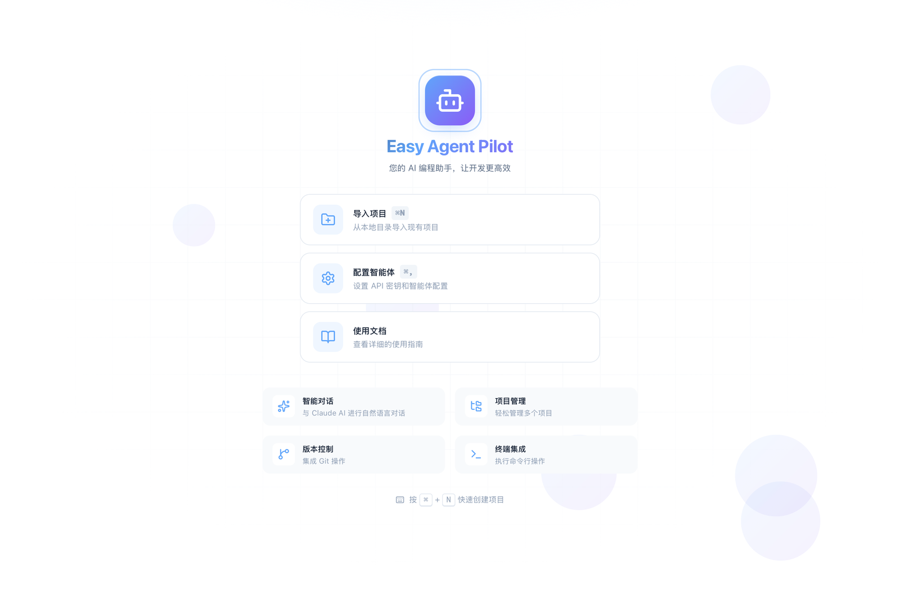

导入 `demo` 后，工作区左侧会显示项目列表，右侧进入空项目状态，准备开始第一轮协作。

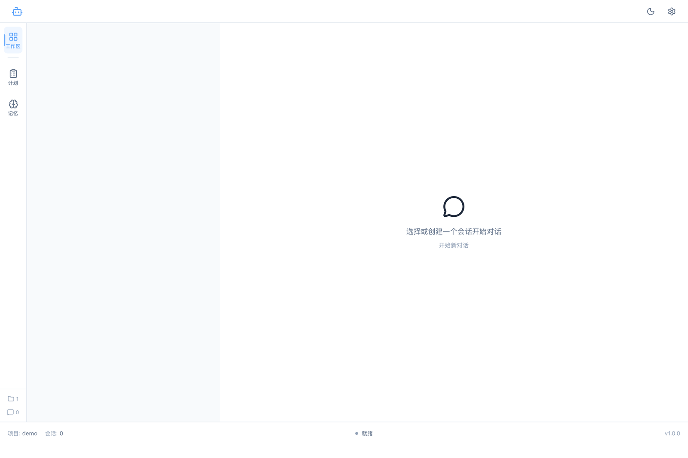

## 2. 工作区与会话

工作区负责承接日常对话。你可以为当前项目创建多个会话，把探索、实现、排障、评审分开管理。

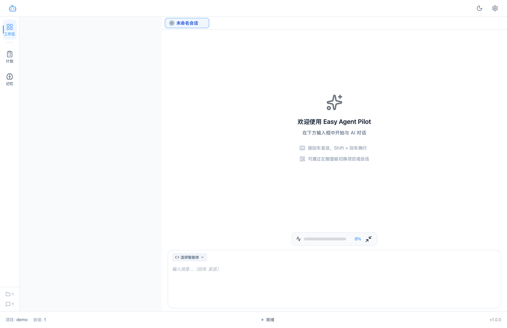

这一层的重点不是简单聊天，而是把会话与项目绑定，使后续计划拆分、任务执行、记忆沉淀都能复用同一份上下文。

## 3. 计划模式与任务拆分

计划模式是整个产品最核心的工作流。它把“我要完成什么”转成“有哪些任务、依赖、验收标准、测试步骤”。

### 3.1 创建计划

计划支持名称、描述、拆分模式、拆分粒度、最大重试次数、拆分 Agent / 模型以及立即执行 / 定时执行。

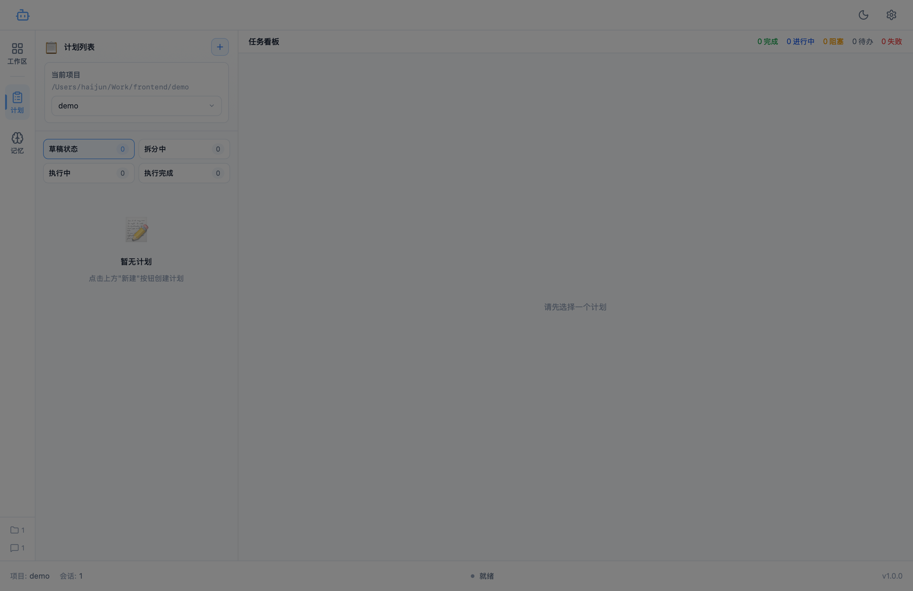

### 3.2 拆分异常可见

当模型输出不满足约束时，系统会保留拆分过程和错误信息，便于继续拆分、修复配置或重新发起。

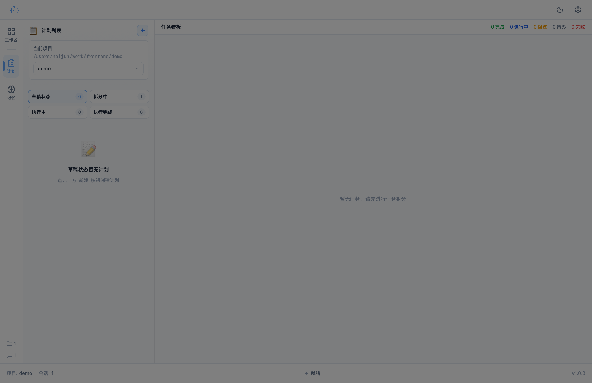

### 3.3 拆分成功预览

在信息足够时，系统会生成结构化任务列表，并在确认前展示完整预览。每个任务都带有优先级、描述、实现步骤、测试步骤和依赖关系。

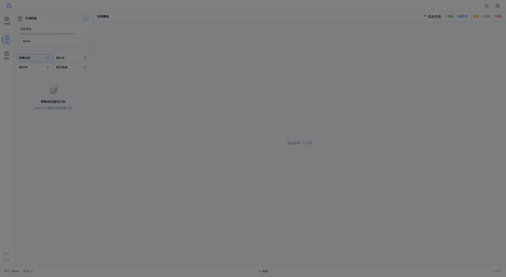

### 3.4 任务看板落地

确认后，拆分结果会正式写入任务库并进入看板。本次实测中，`Schema 直连验证` 被成功拆成 23 个任务，并完整进入待办列。

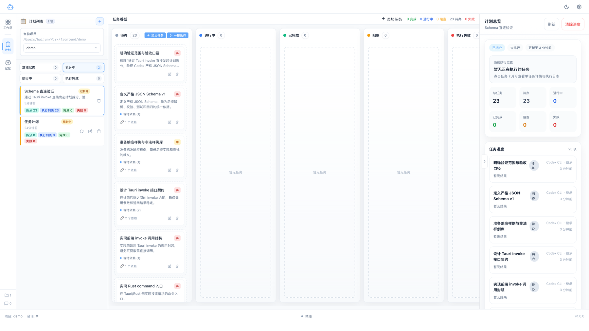

任务看板不是孤立的列表，它同时联动了：

- 左侧计划列表：显示计划状态、任务总数、执行列表、完成数、失败数
- 中间看板：管理任务流转和一键执行
- 右侧详情：展示计划总览、当前执行位置和任务进度

## 4. 设置中心

设置中心是第二个核心区域。这里不仅是偏好设置，更承担了 CLI、Agent、MCP、Skills、Plugins、配置切换、数据治理等系统级能力。

### 4.1 通用设置

这里集中管理语言、字体、自动保存、删除确认、回车发送、会话压缩策略、编辑器行为等基础选项。

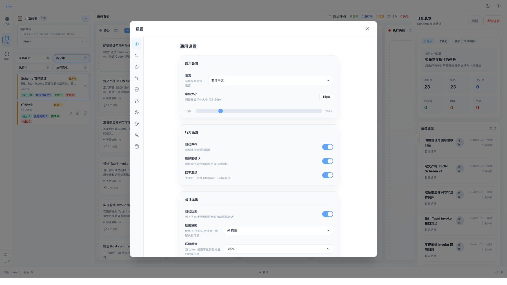

### 4.2 CLI 下载管理

应用会自动探测本机可用 CLI，并显示安装状态、路径、版本以及升级入口。本次环境中同时识别出了 Claude CLI 与 Codex CLI。

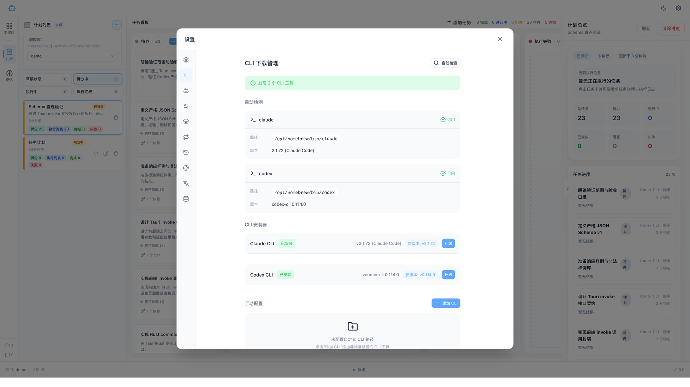

### 4.3 技能市场

技能市场用于发现 MCP 服务、Skills 与 Plugins。即使市场源暂时不可用，界面也会给出明确失败态和重试入口，而不是静默失败。

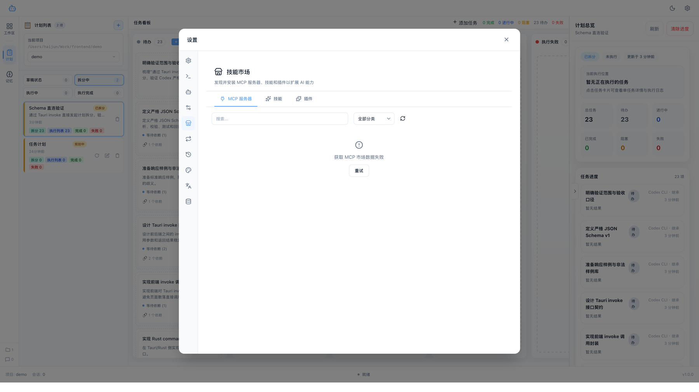

### 4.4 MCP / Skills / Plugins 管理

技能配置页是设置中心里最关键的一块，覆盖了扩展能力的增删改查和调试验证。

| MCP 服务 | Skills 管理 | Plugins 管理 |
| --- | --- | --- |
| 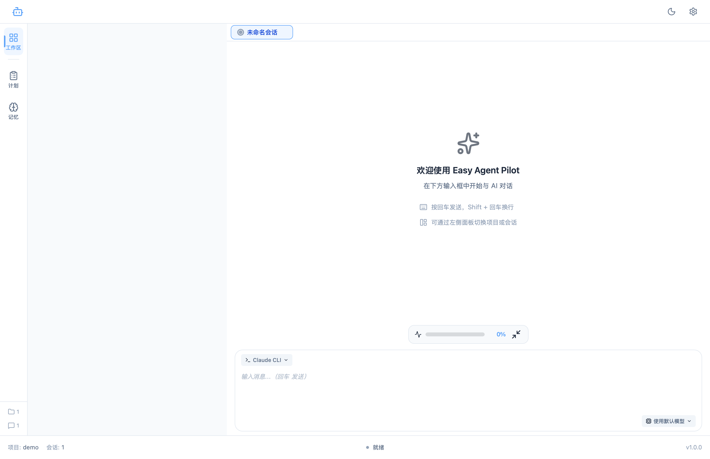 |  |  |

这部分适合管理：

- 已安装 MCP 服务的配置和启停
- 本地 Skill 的发现、安装和启用
- 插件扩展的加载与维护

### 4.5 MCP 工具调试

设置中心内置了工具调试器，可以直接调用 MCP 工具并查看返回结果，方便验证服务是否真的接通，而不是只停留在配置页面。

| 调试器 | 执行结果 |
| --- | --- |
|  | 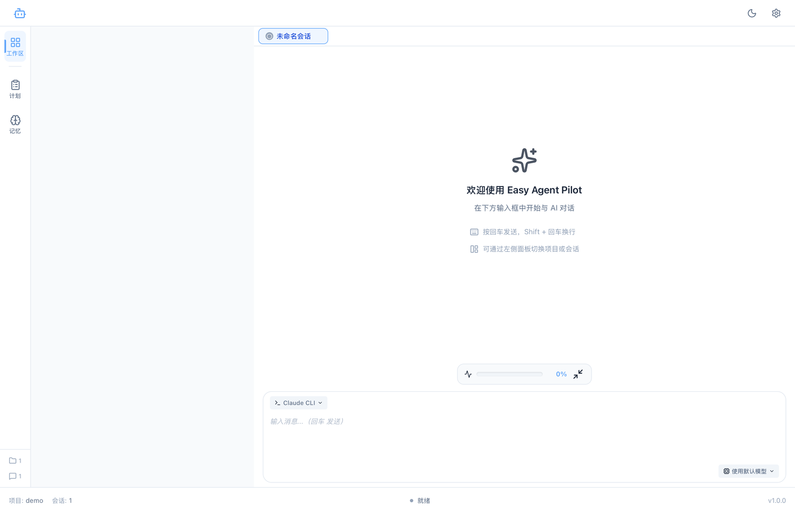 |

### 4.6 配置快速切换

配置切换页用于在不同 Provider 或 CLI 配置之间快速切换，适合同时维护 Claude CLI、Codex CLI 等多套环境。

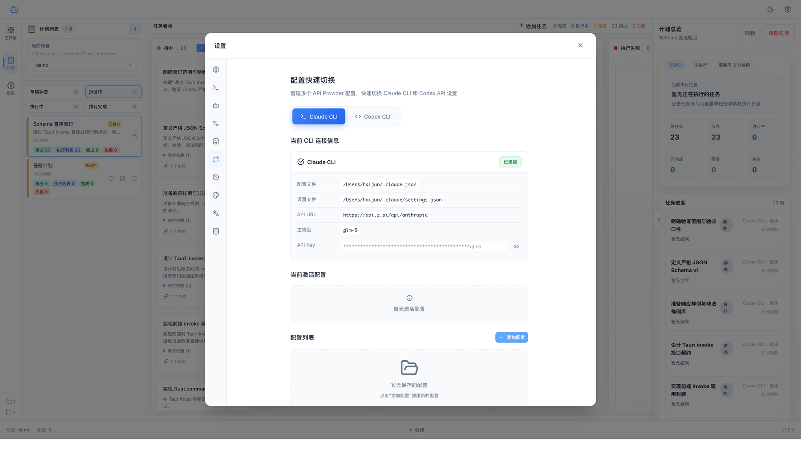

### 4.7 会话管理

会话管理页支持按智能体或项目筛选历史 CLI 会话，统一查看、批量删除或清理陈旧会话。

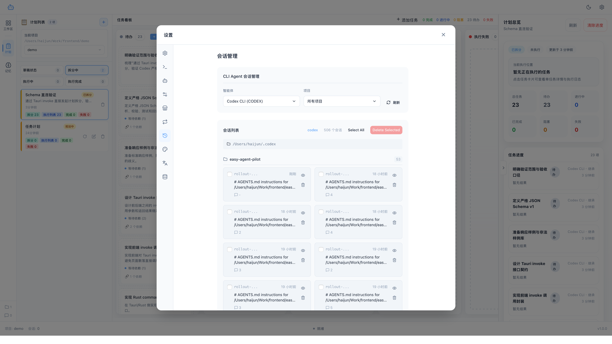

### 4.8 数据管理

数据管理页提供数据路径展示、数据导出、数据导入、重建安装会话等能力，适合迁移、备份和清理本地状态。

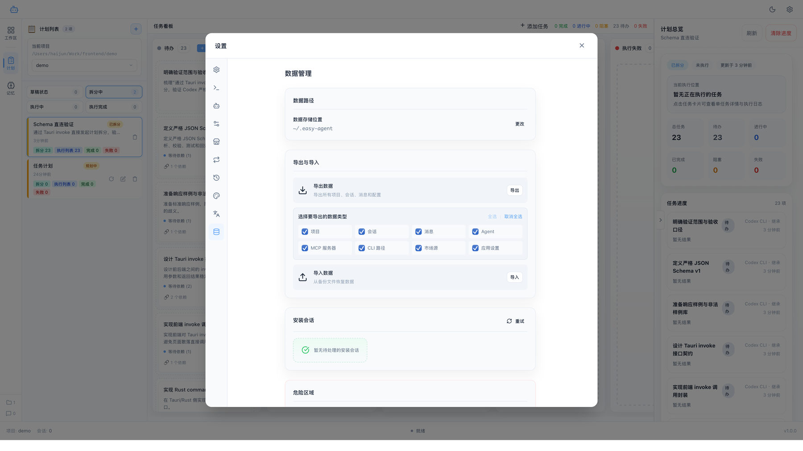

## 5. 本次实测结果

这次 README 编写不是静态整理，而是伴随真实验证完成的。已经确认的关键结果如下：

- 纯净数据库启动正常，项目导入流程可用
- 工作区会话界面可正常创建和承载项目上下文
- 计划拆分链路已经可以稳定产出结构化任务
- `Schema 直连验证` 计划成功生成 23 个任务并落入任务看板
- MCP / Skills / Plugins / 会话管理 / 数据管理等设置页均可正常打开
- MCP 工具调试器可进入实际调用与结果查看流程

## 6. 文档编写过程中修复并复测的问题

本次测试过程中发现并修复了两个影响核心流程的问题：

- Codex CLI 的严格 JSON Schema 与当前 `response_format` 约束不兼容，导致任务拆分失败
- 计划页默认停留在 `draft` 标签，导致无草稿时列表看起来像“空白”，拆分完成后也不利于立刻查看结果

已修复的实现位置：

- [src/services/plan/prompts.ts](/Users/haijun/Work/frontend/easy-agent-pilot/src/services/plan/prompts.ts)
- [src/components/plan/PlanList.vue](/Users/haijun/Work/frontend/easy-agent-pilot/src/components/plan/PlanList.vue)
- [src/components/plan/TaskSplitDialog.vue](/Users/haijun/Work/frontend/easy-agent-pilot/src/components/plan/TaskSplitDialog.vue)

修复后已完成回归验证：

- 任务拆分成功结束并显示 `DONE`
- 确认后任务正确入库
- 计划列表会自动切换到有数据的状态标签
- 当前计划会重新选中，任务看板立即显示结果

## 7. 快速开始

### 运行环境

- Node.js 18+
- pnpm
- Rust
- Tauri 2 构建依赖

### 本地开发

```bash
pnpm install
pnpm dev --host 127.0.0.1 --port 1420
cd src-tauri
cargo run --no-default-features
```

### 首次体验建议流程

1. 启动应用并确认处于纯净状态
2. 导入你的本地项目目录
3. 在工作区创建会话，确认 Agent 可正常对话
4. 进入计划模式，创建一个计划并发起拆分
5. 在任务看板中确认任务数量、依赖关系与状态流转
6. 打开设置中心，检查 CLI、MCP、Skills、Plugins、数据管理等配置

## 技术栈

- Tauri 2
- Vue 3
- TypeScript
- Rust
- SQLite
- Pinia

## 目录说明

```text
easy-agent-pilot/
├── src/                # Vue 前端
├── src-tauri/          # Rust / Tauri 后端
├── images/             # README 截图
└── README.md
```
